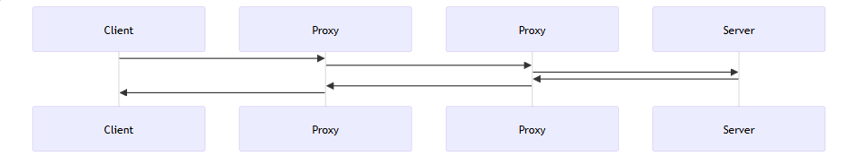

# Project Research

Here the project reaserch prior to start programming the web server lies.

## Table of Contents

- [Project Research](#project-research)
  - [Table of Contents](#table-of-contents)
  - [Concepts](#concepts)
    - [Hyper Text Transfer Protocol 1.1 (HTTP/1.1)](#hyper-text-transfer-protocol-11-http11)

## Concepts

A few concepts are needed to be learned before starting this project, specially
how internally a web server and the http protocol work. To begin this
investigation, i will learn more about the HTTP protocol from the following
sources: [*Mobile Directory Number (MDN)*][1] and *Request For Comments
(MDN)* in the [RFC 9112][4], [RFC 9111][3] and the [RFC 9110][2] pages to gather
the neccesary technical information about how this protocol works internally.

[1]: https://developer.mozilla.org/en-US/docs/Web/HTTP
[2]: https://datatracker.ietf.org/doc/html/rfc9110
[3]: https://datatracker.ietf.org/doc/html/rfc9111
[4]: https://datatracker.ietf.org/doc/html/rfc9112

## Hyper Text Transfer Protocol 1.1 (HTTP/1.1)

A stateless, application-level, resquest/response protocol with extensible
semantics and self descriptive messages for trasnmitting hypertext or hypermedia
documents like HTML. It is for:

- Web browser to web server communication.
- Machine-to-machine communication.
- Programmatic access to API.

Follows the client-server model, a distributed architecture that partitions
tasks and workloads between servers and service requesters between clients. A
client opens a connection to make a request and waits for the server response
to arrive. A **complete document** is constructed by resources like text, video,
images, scripts, etc. Rely on the TCP transport protocol and the TLS-encryption.
All communication occurs over messages.

- **Requests**: messages from client, usually user-agent (web browser usually)
  or proxy, to server.
- **Responses**: messages from server to client.



### Components

- **Client (user-agent)**: tool that acts on behalf of the user, mostly a web
browser, a bot or a program to debug applications.

  1. Sends a request to the server for the HTML document
  2. Sends additional requests to parse the other parts of the document.
  3. Browser combines resources to present the complete document.
  4. Scripts in the browser can fetch more resources.

  - Hypertext means some parts are links that can fetch another web page.

- **Web server**: serves the document, could be multiple servers doing that
job. Could share the same address.

- **Proxies**: Many other intermediate machines that work at different levels
of the TCP/IP stack, have a significant impact on performance. Can do numerous
functions:

  - caching
  - filtering
  - load balancing
  - authentication
  - logging

### Connections

Connections are at the transport layer, out of scope for the protocol. Uses TCP.
Before a request, a TCP conection must be established. Default behaviour is a
TCP connection for each request. With *pipelining* (Hard to implement) and
*persistent connections*. Persistent connections TCP connection can be
controlled using the `Connection` header.

#### Flow from client standpoint

1. Open a TCP Connection
2. Send an HTTP message
3. Read the response
4. Close or reuse connection.

### HTML Message Format

Both request and response are messages, and the RFC defines clearly how a
message is composed of.

```HTML
start-line CRLF
*( field-line CRLF )
CRLF
[ message-body ]
```

The only difference between HTML request and response is in its start-line. For
requests, the start-line is named **request-line**, and for responses it is
named **status-line**. Implementation limits what a server or a client can
expect: client a response, server a request.

- *request-line*: `GET / HTTP/1.1`
  - `GET` method or peration the client wants to perform.
  - `/` path of the resource to fetch.
  - `HTTP/1.1` version of protocol
- *status-line*: `HTTP/1.1 200 OK`
  - `HTTP/1.1` version of protocol
  - `200` status code, indicates the request was succesful or not and why.
  - `OK` status message, a short description of the status code.

## Fetch API

Allows making HTTP requests from JavaScript.
